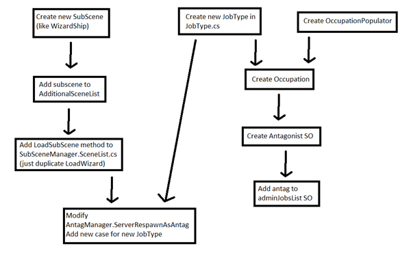
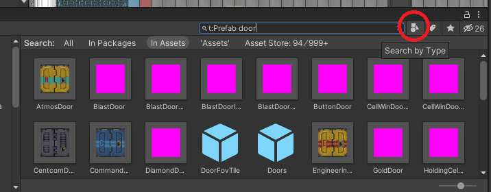
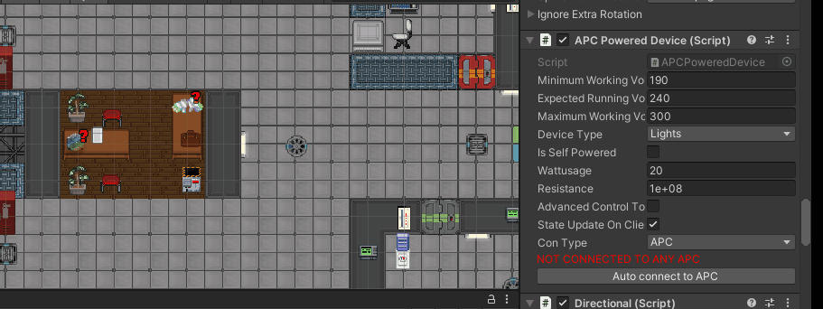
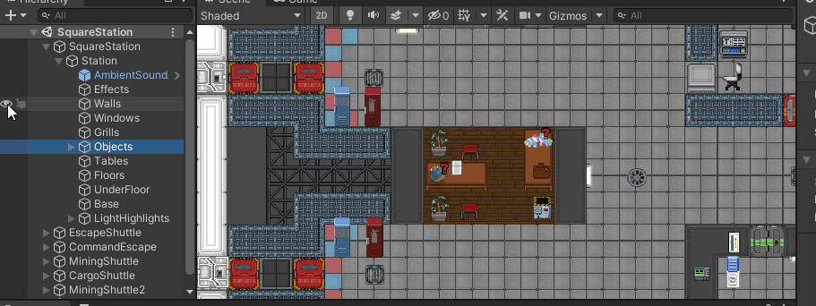

# How to Map

This page explains the details of how to do mapping within unitystation.

All mapping is done in Unity.

### Setting Up Your Workspace
You should have the following windows open. To open a window, go to the _Window_ tab at the top of Unity.
* Window > General > __Scene__
* Window > General > __Project__
* Window > General > __Hierarchy__
* Window > General > __Inspector__
* Window > __Sidebar__

### Introduction to Scenes
Unity uses [scenes](https://docs.unity3d.com/Manual/CreatingScenes.html) to define environments and menus. Let's look at one.
* Open an existing scene: UnityProject > Assets > Scenes > Mainstations > TestStation
* Make sure you have your Scene window focused
* Look around the Scene with the [Hand Tool](https://docs.unity3d.com/Manual/SceneViewNavigation.html)
* To move prefabs around the Scene, use the [Move Tool](https://docs.unity3d.com/Manual/SceneViewNavigation.html)

Notice that in the Hierarchy window selecting _TestStation_ selects the entire station, but not other shuttles, etc.
You can save maps and areas as [prefabs](https://docs.unity3d.com/Manual/Prefabs.html) by dragging them from the Hierarchy tab into the Project tab.

## Getting Started
The processing of mapping depending on what type of scene you are mapping. In UnityStation, scenes are divided into the following scriptable objects:

Main Stations – where all the crew spawns at the start of the round

Away Sites – on the MainStation there is a portal which connects to one of these scenes which the player then jump when the connection is established in the middle of the round.

Additional Scenes – the scenes which the antagonists start on.

Here is a handy diagram which you can use if you want to add a new antagonist or job and ensure that it updates across all the scenes.

## Important Sidebar Functions

When you open the editor, there should be a sidebar open on the right hand side of your screen. If it is not present, go Window -> Sidebar to make it appear. This sidebar will help you through some of the processes as you map. From Top to Bottom they are:
### Test Runner
Performs a variety of tests to check for Null references and other things. These tests are also used when you send a Pull Request.

### Tile Palette
* The Tile Palette tab lets you place walls, floors, doors, tables etc. into the Scene tab
* Make sure to select the right Active Tilemap in the Tile Palette when editing
* The new tiles and objects will be added to the right categories within the active tilemap automatically

Keep in mind when editing a Tile Palette that tiles are added to the palettes as they are created. To create a new Tile follow this example:
- Choose a tile from /Tilemaps/Tiles/Objects
- Drag a tile to a palette

### Matrix Check
This tool allows you to check out atmospherics details when you run the executable in the editor (temperature, pressure, etc. on each tile). Good for making sure you haven’t left a gap somewhere, make sure that you have Gizmos enabled.

### LogLevels
Monitors certain variables when you are in play mode editor. Useful for debugging.

### PixelArt Editor
Not necessary for mapping purposes.

## Creating a MainStation Map
* TODO: How do you add your new map for map selection, other than this: [Testing custom maps in Multiplayer](../contribution-guides/Building-And-Testing.md)?

1.	Copy and paste the NewStation Scene inside Asset/Scenes Folder, do not have Unity open when you do this.
2.	Open up the Tile Palette, select base floors and begin the process of painting the tiles to make up the Station.
3.	Next you will want to designate where the departments should go and how big they should be. Move the spawn points to generally mark out the areas so you can keep track of where everything is going. How you approach the rest is up to you, steps 4 to 7 below is a suggested method for you to use if you wish.
Consider then mapping in all the power cables, atmos pipes and disposal pipes. This is all the important life support stuff that makes the station function. This step can be done at any time, however, a lot of LighTubeFixtures, LightBulbFixtures, AirVents, Scrubbers, Pumps, Mixers, GasConnectors, Filters, UnaryVents, Metres and DisposalBins are required for the station to run. See Step 5 for details on how to add existing prefabs onto a Scene.

UnityStation’s Electrical Wiring differs from base SS13. Follow the guide below to make sure you correctly hook everything up.

Make sure to always put a machine connector (white square in diagram) on the lower voltage side of the device. If you are still stuck, consult the wiring on TestStation Scene in the Electrical Testing Area and inspect the relevant prefabs.

The atmos pipes are colour coded to help keep track of a specific function, use the following convention:

* Blue – Exports Gas out into the Station to the AirVents
* Red – Imports Gas back into the Atmospherics Department from the Scrubbers
* Green – Connects to Red Pipes has Filter prefabs littered through is section to filter out each gas to its specific canister chamber
* Yellow – Connects to pumps to pump out gas from a particular gas chamber, yellow pipes connect up to the end of the Green and Blue pipes
* Light Blue – These pipes connect up the canisters of nitrogen and oxygen that everyone will be breathing. They replace the yellow pipes for the air canister and connect directly to the blue pipes.
* Silver/Purple Pipes – These pipes are the internal pipes for the department which connect up to GasConnectors, these connectors allow an atmos tech to pump gas into/out of a gas canister into the pipes.

Make sure that the pumps to do with the air are turned on and that all the canisters in the chamber rooms have been set to open in the prefab, otherwise no gas will flow.

With the Disposal Bins, all Bins must be connected with disposal pipes and flow into the Mail Room inside Cargo. All trash will move from a DisposalOutlet into a DisposalInlet prefab via a conveyer belt before journeying to the Disposal room. In this room all trash is ejected into space through the Mass Driver.

To help with completing Step 6, click and drag all prefabs onto the scene, select them all in the Hierarchy and drag them into the Matrix’s Object layer when you feel you are finished.

4.	Add in the Walls to designate the rooms, relevant floor tiles and tables to populate the rooms. Remember that floor tiles are not present in maintenance areas, unless it is in a room coming from a corridor.
5.	To place objects into a scene search in the File manager with the prefab filter on, then click and drag the prefab onto the scene. All objects you place will need to go on the Station Matrix’s Object layer in the Hierarchy. IMPORTANT: make sure you keep consistent unique number or attach an “_name” (e.g. APC_Kitchen), this will help a lot when you need to add in references to other prefabs, as you can tell them apart.

6.	Add in all the other prefabs. Don’t worry if you aren’t getting the x,y co-ordinates close to the centre of a grid square, the Custom Net Transform always has Snap To Grid enabled, so it will have perfect co-ordinates in-game.
7.	As you progress placing the objects down onto the matrix, make sure you modify the relevant fields on the prefabs so that they can be referred to by the other relevant prefabs. The best way to see what prefabs relate to what is to open an existing map and turn on gizmos. Make sure all of the gizmos are turned on and if a line exists between the prefab and another, then a relationship exists. As there are a multitude of components that can exist on a prefab, it is best to read through them to understand what they are doing and what they need, some have tooltips to help. Always remember you can look at existing maps to see how the prefabs are connected.
8.	All the shuttles need the Retro Control System (RCS) Thrusters to be added onto the outside of the shuttle matrixes. Follow instructions detailed [here](https://github.com/unitystation/unitystation/pull/5111).

## Mapping Guidelines and Pointers
Objects should never be rotated using the Transform. Their local rotation should always be 0, 0, 0. If you change it, it will either not have any effect or may have unexpected consequences. If there is any need to rotate an object, define its facing, etc...it should be done via Directional or other components.

Various objects which already have directional facing logic, such as wallmounts and chairs, can have their direction set by adjusting Directional's Initial Direction field.

### Map Tips
Here are some general tips to help you get when mapping in UnityStation:
- Do not attempt to try and finish your map from scratch in one sitting, it is better if you break it down into sections.
- If you find yourself unable to place tiles from the Tile Palette and are receiving a ton of warnings, it may be because you are missing a layer in the matrix. Duplicate an existing layer in the matrix and perform the necessary changes before trying to place anymore tiles.
- Attaching an APC can be quite tedious, but can be made a lot easier if you place the APC first, relabel it and then attach the APCPoweredDevice by moving it close to the APC and hitting the Auto Connect Button.

- Make sure for jobs that will have 2 or more signing up to them that you have placed multiple spawn points in the department – this ensures that players do not spawn ontop of each other. To do this, copy an existing spawn point inside the SpawnPointsV2 object, alter its position and spawn name.

- So you can see what you are placing tile-wise on a particular layer, you can select obstructing layers to hide in the Hierarchy. You then can press the crossed-out eye above the scene view window to toggle the layers’ visibility. 

- Make sure you have put tiny fans on all the airlock exits into space on stations and shuttles to help stop space wind problems.

If you are ever stuck mapping in UnityStation first try looking at how the current maps work, what components make up an object. If all else fails, please message the mapper channel on discord.

### Wallmounts
Wallmounts always appear upright, but you need to indicate which side of the wall they are on (they should only be visible from one side of a wall). To do this, simply set the Directional component's Initial Direction to the direction it should be facing.

Enabling Gizmos for WallmountBehaviours will show helper arrows so that you wouldn't need to guess their direction:

## Pull Request a New Map Scene to the Repo
Once you have finished mapping a scene and it’s time to PR, follow the instructions below so it gets submitted first time without needed rework. If you are working on an existing map, you only need to commit and PR the .scene file.

1. Run the Unit tests. These can be accessed in editor by going into the sidebar menu or selecting the U logo on the right bar.

2. If the scene you have created is a Main Station, add its name into to the map.json file. This file keeps track of what maps to randomly select from given the server population (low, medium, high pop).

3. Next you will need to add the created scene into a Scriptable Object List. Search in the editor
-	If it is a Station where the crew will spawn in, add it into the Main Station List SO
-	If the scene is a scene which connects to the Station Gateway, add it into the Away World List SO
-	If the scene is an asteroid (contains ores to mine), add it into the Asteroid List SO
-	If the scene is an antag spawn area or some other scene that doesn’t fit into the ones above, add it into the Additional Scene List SO

4. Add the Scene in by going to File -> Build Settings, then click open scene to add the scene you are in.

5. Make sure you go through the checklist below to check you have gotten the following on the map.

- In the Captain’s Room, there is a Nuke disk, Nuke pointer and Captain’s spare ID
- Make sure that Security has Cell Timers and Secure Windoors to hold prisoners in the brig
- Fire alarms are connected to FireDoors
- AirVents and Scrubbers are rotated correctly to match the particular pipe outlets
- RCS are present on shuttle matrixes
- Multiple spawn points exist for the same job and that all jobs have a sensible spawn point.
- Check atmos canisters are open in the atmospherics room
- No obvious extrusions that will destroy or block the cargo/evac shuttle
- Directional Signs to help players navigate to each department (Prefabs are called SignDirectional)
- If it’s a MainStation, include a picture of your map for the wiki

## Pull Requests for Tile Palette Changes
Almost never would you need to actually PR a palette change, if you do please make sure __NOT__ to include anything other than the palette file and its .meta file.
